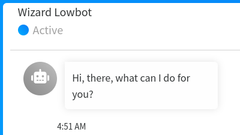

# ChatBot_ReactJS




## :information_source: About  

A chatbot using ReactJS and react-chatbot-kit library made by @github.com/FredrikOseberg 


## :wrench: Tools
- Reactjs 18.2.0 or above
- [react-chatbot-kit library](https://fredrikoseberg.github.io/react-chatbot-kit-docs/)
- CSS


## :inbox_tray: Setup for contributions

1. Open a terminal and run these commands :

```bash
git clone git@github.com:loickcherimont/ChatBot_ReactJS.git
cd ChatBot_ReactJS
```

2. Retrieve all dependencies and fix possible bugs :

```bash
npm i
npm audit fix
```

3. Launch the project

```bash
npm run dev
```

4. The project is ready!

## :warning: Prerequisites

- [react-chatbot-kit library](https://fredrikoseberg.github.io/react-chatbot-kit-docs/) : Follow the [documentation](https://fredrikoseberg.github.io/react-chatbot-kit-docs/docs/)


## :thinking: How does it run ?

You can talk with the bot using button or keyboard.  

If you use an invalid request, the bot returns an error.  


For Documentation of the app, open a terminal and run this command in the project :

```bash
jsdoc src/*
```

> [!TIP]
> Ask something as **time**, **hello**, the bot will answer.

## :test_tube: Features
- Fix the user's location
 
## :key: License

Developed by Loick Cherimont  

Under MIT License  

Last edited on: 2024-08-10
